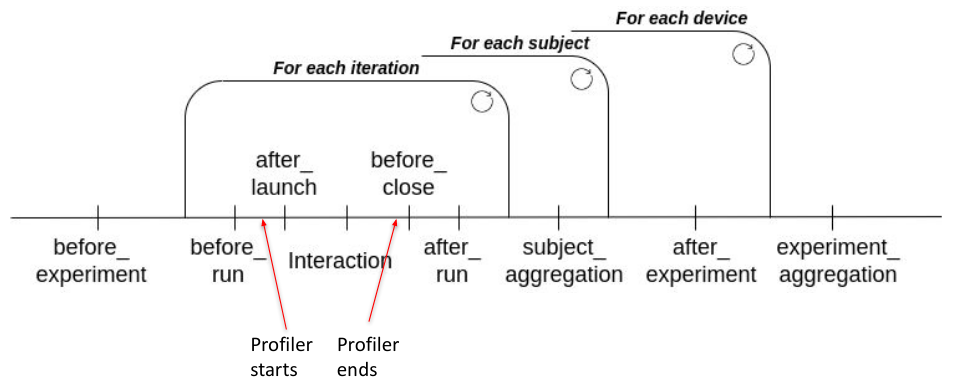

# GreenLab-Lab1
## Overview
* Motivation
    * Why do we need to test mobile apps?
* Tools
    * Profilers explained
        * Monsoon (hardware)
        * BatteryManager (software)
        * PowerJoular (software)
    * ADB Overview
        * install, run, uninstall, logcat, pull, push, shell among others

## ADB demo
* Set up device
* Connect to device
* Install an app
* Run an app
* Uninstall an app
* Logcat
* Pull
* Push
* Shell
* Wireless connection
* Troubleshooting ([fix experiment aggregation](./resources/fix_experiment_aggregation.py))

## AndroidRunner how does it work?
* Files
    * config files
        * `run_stopping_condition`
        * `usb_handler` + caveats (RasPI 4B)
    * script files (and order)
    
    * interaction files
    * output files
    * `--progress` flag
* Profilers
    * BatteryManager (with companion)
    * Read the [BatteryManager README](https://github.com/S2-group/android-runner/tree/master/AndroidRunner/Plugins/batterymanager#readme)
    * Troubleshooting BatteryManager

## AndroidRunner
* [Before experiment checklist](./resources/android_exeriment_checklist.md)

## ExperimentRunner
* Read the PowerJoular README in ExperimentRunner ([here](https://github.com/S2-group/experiment-runner/tree/master/examples/linux-powerjoular-profiling))

# Useful links
## AndroidRunner
- Older video tutorials: https://www.youtube.com/playlist?list=PLLbZZOioDh3P50WcYbuBMZEJokJH3ZONr
- developer options: https://developer.android.com/studio/debug/dev-options
- adb: https://developer.android.com/studio/command-line/adb
- adb logcat: https://developer.android.com/studio/command-line/logcat
- wireless connection: https://developer.android.com/tools/adb#wireless or [wifi connect shell script](./resources/adb_connect_wifi.sh)
- AndroidRunner: https://github.com/S2-group/android-runner
- apks: https://apkpure.com/
- BatteryManager-companion: https://github.com/S2-group/batterymanager-companion
- BatteryManager-companion apk: https://github.com/S2-group/batterymanager-companion/releases/tag/v1.0.0
- monkeyrunner: https://android.googlesource.com/platform/sdk/+/ics-mr0/monkeyrunner?autodive=0%2F%2F

## ExperimentRunner
- ExperimentRunner: https://github.com/S2-group/experiment-runner
- PowerJoular: https://gitlab.com/joular/powerjoular
